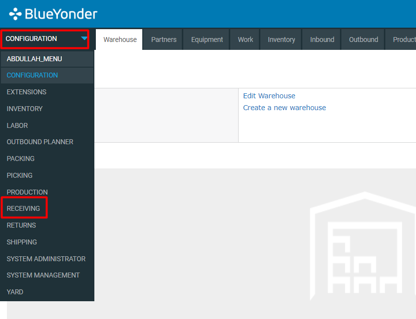

# **BASE_INB_0001100_COPY_TEMPLATE_RCVTRK_MOCA_V001**

<!-- SMART_DOC_GEN_TEST_DESCR - Start -->
Copy a template receive truck to a new one
<!-- SMART_DOC_GEN_TEST_DESCR - End -->

Sherazi ILU

## **Test Category**

<input type="checkbox" checked disabled> Standard
 
<input type="checkbox" disabled> Custom
 
<input type="checkbox" disabled> Smart IS

## **Overview**

Copying an existing inbound order within a system involves duplicating an established order's details to streamline the process of creating a similar transaction. This functionality is beneficial when dealing with recurrent or similar orders, saving time, and ensuring consistency. To initiate this action, the user typically needs to identify the existing order they want to replicate. The system may prompt them to provide details like the order number or use a search function to locate the specific order. Once the order is identified, the user can trigger the copy operation, generating a new order with the same or similar attributes as the original. This feature is invaluable for professionals who frequently handle repetitive transactions, enhancing efficiency and reducing the likelihood of errors in data entry. When copying an existing order, it's essential to understand that certain elements, such as client information, product details, and quantities, will be replicated in the new order. Additionally, users may have the option to modify specific parameters before finalizing the creation of the duplicated order.

## **Applicable versions**

This test is designed to support versions greater than **2008.x.x**, ensuring compatibility and smooth operation with the latest software releases. Users can confidently utilize this test, as it is optimized for newer versions while retaining a user-friendly testing process.

## **Test Arguments**

Test arguments are parameters or inputs that are passed to the test cases to customize the test execution. These arguments provide flexibility and allow for the reuse of the same test case with different sets of data or configurations. The input is as follows:

<!-- SMART_DOC_GEN_TEST_ARG - Start -->
<table>
<tr><th>Arguments</th><th>Argument Description</th></tr>
<tr><td>uc_copy_rcvtrk_inv_flg</td><td>If 1 we copy ASN inventory as well</td></tr>
<tr><td>uc_create_receive_invoice_ctxt_cmd</td><td>Context for create receive invouce command</td></tr>
<tr><td>uc_create_receive_invoice_line_ctxt_cmd</td><td>Context for create receive line command</td></tr>
<tr><td>uc_create_receive_truck_ctxt_cmd</td><td>Context for create reeive truck command</td></tr>
<tr><td>uc_new_invnum_expr</td><td>New invnum follows this expression</td></tr>
<tr><td>uc_new_ponum_expr</td><td>New Ponum in rcvinv follows this expression</td></tr>
<tr><td>uc_new_trknum</td><td>If we want to use a specific trknum, use this</td></tr>
<tr><td>uc_new_trknum_expr</td><td>New truck number is based on this expression</td></tr>
<tr><td>uc_rcvlin_filter_sql</td><td>When finding rcvlin in source, apply this SQL filter</td></tr>
<tr><td>uc_src_trknum</td><td>Copy this rcvtrk</td></tr>
<tr><td>uc_test_exec_seqnum</td><td>During each run, it generates a unique base-36 value.</td></tr>
</table>
<!-- SMART_DOC_GEN_TEST_ARG - End -->

## **TestCases using this test**

This section provides a comprehensive list of test cases that are associated with this particular test. It provides a quick reference for understanding the specific tests covered. By reviewing these test cases, users can gain a deeper understanding of how this test is used in different scenarios and ensure comprehensive test coverage.

<!-- SMART_DOC_GEN_TEST_CASE_USING_THIS - Start -->
| Test Case ID | Test Case Description |
| ------------ | --------------------- |
| BASE_ALL_GEN |  |

<!-- SMART_DOC_GEN_TEST_CASE_USING_THIS - End -->

## **RunSets using this test**

This section details the various RunSets that utilize this test as part of their execution. Each RunSet represents a collection of tests and configurations that are executed together to achieve specific testing goals. By examining the RunSets that include this test, users can understand how it fits into larger testing scenarios and how it contributes to overall test coverage and automation.

<!-- SMART_DOC_GEN_RUN_SET_USING_THIS - Start -->
| Run Set ID | Run Set Description |
| ---------- | ------------------- |
| BASE_INB_000000_CREATE_TO_DISPATCH | This takes rcvtrk data, copies it, checks in, reeives, and dispatches |
| BASE_INB_000100_CREATE_TO_DISPATCH_USING_RF | Copy master receipt, identify putaway using RF |

<!-- SMART_DOC_GEN_RUN_SET_USING_THIS - End -->

## **Equivalent Usecase**

The following steps represent a general procedure for Copy an order from existing order through GUI.
 
**Step:1**

Select **Configuration** > **recieving**

**Step:2**

n the grid, click the inbound shipment to which you want to add an order. The inbound shipment details are displayed.

**Step:3**

Above the orders grid, from the Actions drop-down list, select Copy Inbound Orders to Shipment.

**Step:4**

In the Inbound Orders grid, perform one of the following tasks:
-  To copy one or more orders (including all order lines), select the check box next to one or more orders.
-  To copy specific lines from an order, expand the order to display the lines, and then select the check box next to one or more order lines.

**Step:5**

Click Add to Shipment. A planned inbound order is added to the shipment and assigned an application-generated identifier.

## **Applicable MOCA commands**

To copy a order the following MOCA command you can use.

-   **create_receive_invoice**
-   **uc_create_receive_invoice_line_ctxt_cmd**
-   **uc_create_rcvlin_cmd**
-   **create_asn_invsub**

This command will trigger the inventory move command based on the predefined parameters and rules within the MOCA system.

## **Affected DB Tables**

When copy order action perform, the following database tables are typically affected:

-   **rcvinv**

-   **rcvlin**

-   **invdtl**

-   **invhld**

-   **hldmst**

---

 **Previous-Test**
 [BASE_OUB_0050100_LIST_PICK_RF_V001](./tests_docs/BASE_OUB_0050100_LIST_PICK_RF_V001.md)
 
**Next-Test**
  [BASE_INB_0002100_TRLR_CKIN_MOCA_V001](./tests_docs/BASE_INB_0002100_TRLR_CKIN_MOCA_V001.md)

[SMART-IS](https://www.smart-is.pk) 