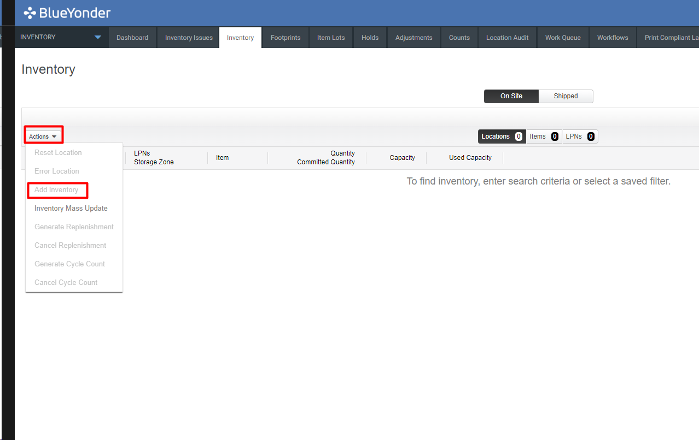

# **BASE_INV_CREATE_MOCA_V001**

<!-- SMART_DOC_GEN_TEST_DESCR - Start -->
Create multiple pallets in a location.  The destination location is created by copying a template location - this provides a way to seggregate inventory for each test run.  The inventory characteristics and pallet count are passed in.
<!-- SMART_DOC_GEN_TEST_DESCR - End -->

## **Test Category**

**☐** Custom

**☐** Smart IS

**🗹** Standard

## **Overview**

The Inventory Create feature allows users to input a variety of items
and their corresponding attributes with precision. This includes details
such as product descriptions, materials, quantities, and specific
storage locations. By doing so, users can maintain accurate and
up-to-date records of their inventory. Additionally, this functionality
enables users to efficiently create multiple pallets within specified
locations, streamlining the overall inventory management process.

Users can leverage the Inventory Create feature to input diverse items
and their associated attributes accurately. This includes specifying
details such as product descriptions, materials, quantities, and
specific storage locations. By doing so, users can ensure the
maintenance of precise and current inventory records. Furthermore, this
functionality empowers users to effortlessly generate multiple pallets
within designated locations, thereby enhancing the efficiency of their
inventory management processes.

## **Applicable versions**

This test is designed to support versions greater than **2008.x.x**,
ensuring compatibility and smooth operation with the latest software
releases. Users can confidently utilize this test, as it is optimized
for newer versions while retaining a user-friendly testing process.

## **Test Arguments**

Test arguments are parameters or inputs that are passed to the test
cases to customize the test execution. These arguments provide
flexibility and allow for the reuse of the same test case with different
sets of data or configurations. The input is as follows:

<!-- SMART_DOC_GEN_TEST_ARG - Start -->
<table>
<tr><th>Arguments</th><th>Argument Description</th></tr>
<tr><td>Ftpcod</td><td>This specifies the footprint to use. If not provided, the footprint returned by prtftp for the part is used.</td></tr>
<tr><td>inv_attr_str1</td><td>Inventory attribute strings.</td></tr>
<tr><td>inv_attr_str2</td><td>Inventory attribute strings.</td></tr>
<tr><td>inv_attr_str3</td><td>Inventory attribute strings.</td></tr>
<tr><td>inv_attr_str4</td><td>Inventory attribute strings.</td></tr>
<tr><td>inv_attr_str5</td><td>Inventory attribute strings.</td></tr>
<tr><td>Invsts</td><td>If not provided, the receive status from prtmst is used.</td></tr>
<tr><td>Lotnum</td><td>This specifies the lot to use. If not provided, the lot with the latest expiration date is used.</td></tr>
<tr><td>new_untqty</td><td>This specifies the quantity of the newly created inventory. If not provided, it defaults to the unit quantity per pallet.</td></tr>
<tr><td>Orgcod</td><td>If not provided, the receive status from prtmst is used.</td></tr>
<tr><td>Palcnt</td><td>This is the number of loads to create.</td></tr>
<tr><td>Prt_client_id</td><td>This is the client ID for the part. It defaults to a specific value if not provided.</td></tr>
<tr><td>Prtnum</td><td>This specifies the part for which inventory is being created.</td></tr>
<tr><td>Revlvl</td><td>If not provided, the receive status from prtmst is used.</td></tr>
<tr><td>Uc_dstloc</td><td>This is the location where the inventory will be created.</td></tr>
<tr><td>uc_dstloc_expr</td><td>If no destination location is provided, this expression is used to generate one. The default expression is "ADSTLOC" || @uc_test_exec_seqnum</td></tr>
<tr><td>uc_lodnum_prefix</td><td>This is the prefix for newly created loads. If provided, the loads are created with this prefix followed by the sequence number. If not provided, the loads are created with the next available load number.</td></tr>
<tr><td>uc_template_dstloc</td><td>If no destination location is provided, this location is copied to create a new storage location.</td></tr>
<tr><td>uc_test_exec_seqnum</td><td>During each run, uc_test_exec_seqnum generates unique base-36 value.</td></tr>
<tr><td>wh_id</td><td>This is the warehouse ID where the inventory will be created.</td></tr>
</table>
<!-- SMART_DOC_GEN_TEST_ARG - End -->

## **TestCases using this test**

This section provides a comprehensive list of test cases that are associated with this particular test. It provides a quick reference for understanding the specific tests covered. By reviewing these test cases, users can gain a deeper understanding of how this test is used in different scenarios and ensure comprehensive test coverage.

<!-- SMART_DOC_GEN_TEST_CASE_USING_THIS - Start -->
| Test Case ID | Test Case Description |
| ------------ | --------------------- |

<!-- SMART_DOC_GEN_TEST_CASE_USING_THIS - End -->

## **RunSets using this test**

This section details the various RunSets that utilize this test as part of their execution. Each RunSet represents a collection of tests and configurations that are executed together to achieve specific testing goals. By examining the RunSets that include this test, users can understand how it fits into larger testing scenarios and how it contributes to overall test coverage and automation.

<!-- SMART_DOC_GEN_RUN_SET_USING_THIS - Start -->
| Run Set ID | Run Set Description |
| ---------- | ------------------- |

<!-- SMART_DOC_GEN_RUN_SET_USING_THIS - End -->

## **Equivalent Usecase**

The following steps represent a general procedure for creating inventory
through GUI.

**Step:1**

Select **Configuration** > **Inventory**

**Step:2**

Click on the **Inventory** screen.

**Step:3**

After that you must select the specific location in which you want to
create inventory. After selecting inventory go to **Action** and **Add
Inventory**.

**Step:4**

You must put required arguments in this step.

**Step:5**

After putting arguments, you just need to click on Next and your
required inventory will add on this location.

## **Applicable MOCA commands**

To create the inventory using the MOCA command, you can use the
following command.

-   **Create inventory**

This command will trigger the inventory creation based on the predefined
parameters and rules within the MOCA system.

## **Affected DB Tables**

When creating the inventory, the following database tables are
typically affected:

-   **inventory_view**

-   **locmst**

-   **prtmst_view**

These tables are integral components of the inventory management system
and are essential for tracking and summarizing inventory data.

---

 **Previous-Test**
 [BASE_OUB_0010A00_ORD_SUBCONTR_MOCA_V001](./tests_docs/BASE_OUB_0010A00_ORD_SUBCONTR_MOCA_V001.md)
 
**Next-Test**
  [BASE_INV_MOVE_MOCA_V001](./tests_docs/BASE_INV_MOVE_MOCA_V001.md)

[SMART-IS](https://www.smart-is.pk) 