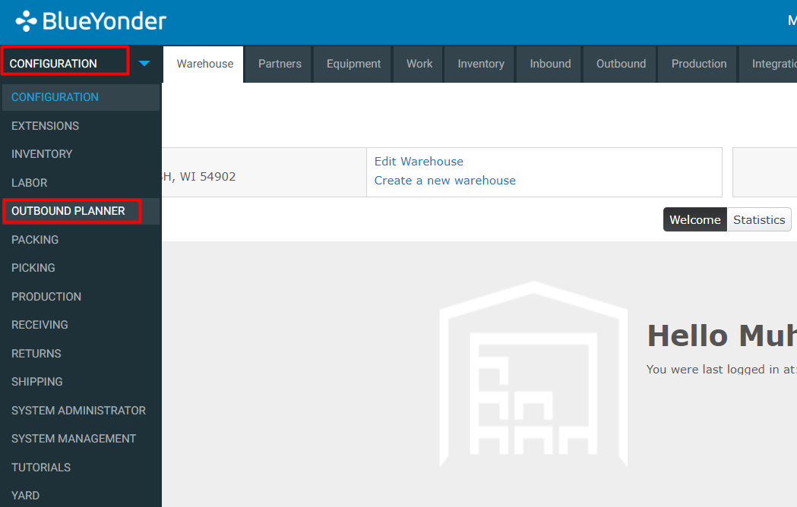
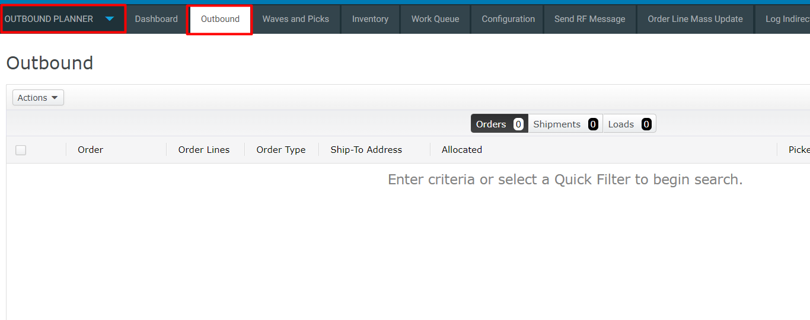
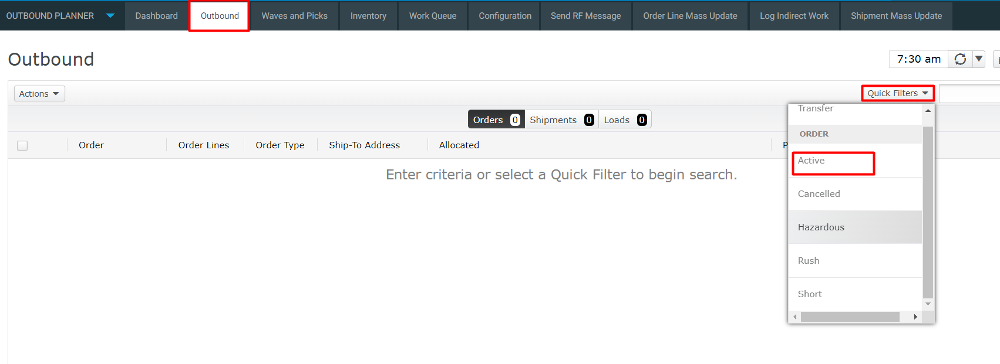
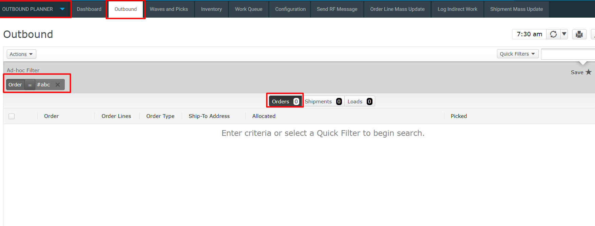
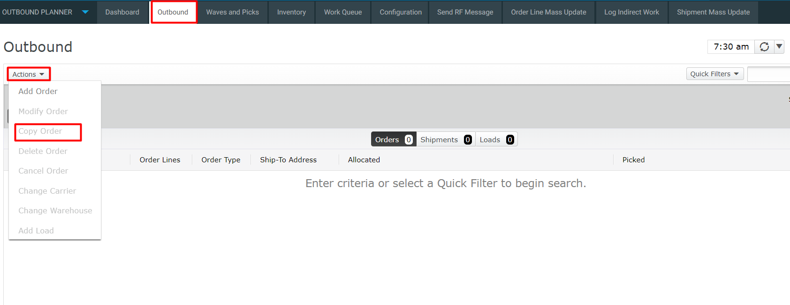
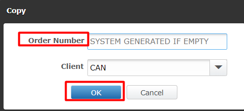

# **BASE_OUB_0010000_ORD_COPY_TEMPLATE_MOCA_V001**

<!-- SMART_DOC_GEN_TEST_DESCR - Start -->
This is the starting point of typical outbound tests.  It assumes that we have a template order.  It copies that order using the [copy order] command to a new order number.  The template order number can be a wild card, so it can create multiple orders.  All orders get the same value in wave_set column which allows us to later plan a single wave for these orders.
<!-- SMART_DOC_GEN_TEST_DESCR - End -->

## **Test Category**

<input type="checkbox" checked disabled> Standard
 
<input type="checkbox" disabled> Custom
 
<input type="checkbox" disabled> Smart IS

## **Overview**

Copying an existing order within a system involves duplicating an established order's details to streamline the process of creating a similar transaction. This functionality is beneficial when dealing with recurrent or similar orders, saving time, and ensuring consistency. To initiate this action, the user typically needs to identify the existing order they want to replicate. The system may prompt them to provide details like the order number or use a search function to locate the specific order. Once the order is identified, the user can trigger the copy operation, generating a new order with the same or similar attributes as the original. 

This feature is invaluable for professionals who frequently handle repetitive transactions, enhancing efficiency and reducing the likelihood of errors in data entry. When copying an existing order, it's essential to understand that certain elements, such as client information, product details, and quantities, will be replicated in the new order. Additionally, users may have the option to modify specific parameters before finalizing the creation of the duplicated order.

## **Applicable versions**

This test is designed to support versions greater than **2008.x.x**, ensuring compatibility and smooth operation with the latest software releases. Users can confidently utilize this test, as it is optimized for newer versions while retaining a user-friendly testing process.

## **Test Arguments**

Test arguments are parameters or inputs that are passed to the test cases to customize the test execution. These arguments provide flexibility and allow for the reuse of the same test case with different sets of data or configurations. The input is as follows:

<!-- SMART_DOC_GEN_TEST_ARG - Start -->
<table>
<tr><th>Arguments</th><th>Argument Description</th></tr>
<tr><td>client_id</td><td>Identify the client_id for the operation. If not provided, the system will use the client_id from the source order.</td></tr>
<tr><td>uc_new_ordnum_expr</td><td>MOCA Expression to create new order</td></tr>
<tr><td>uc_new_wave_set_expr</td><td>Specify what wave set is set for future wave planning in the order lines.</td></tr>
<tr><td>uc_set_wave_set</td><td>While creating multiple orders in one call, assign all these orders to 1 wave the Default wave set is ‘1’</td></tr>
<tr><td>uc_src_ordnum_expr</td><td>Specify the source order number or numbers that you want to work with.</td></tr>
<tr><td>uc_test_exec_seqnum</td><td>During each run, it generates unique base-36 value.</td></tr>
<tr><td>wh_id</td><td>Choose the warehouse where you want to perform actions. If not provided, the system will use the warehouse from the source order.</td></tr>
</table>
<!-- SMART_DOC_GEN_TEST_ARG - End -->

## **TestCases using this test**

This section provides a comprehensive list of test cases that are associated with this particular test. It provides a quick reference for understanding the specific tests covered. By reviewing these test cases, users can gain a deeper understanding of how this test is used in different scenarios and ensure comprehensive test coverage.

<!-- SMART_DOC_GEN_TEST_CASE_USING_THIS - Start -->
| Test Case ID | Test Case Description |
| ------------ | --------------------- |
| BASE_ALL_GEN |  |

<!-- SMART_DOC_GEN_TEST_CASE_USING_THIS - End -->

## **RunSets using this test**

This section details the various RunSets that utilize this test as part of their execution. Each RunSet represents a collection of tests and configurations that are executed together to achieve specific testing goals. By examining the RunSets that include this test, users can understand how it fits into larger testing scenarios and how it contributes to overall test coverage and automation.

<!-- SMART_DOC_GEN_RUN_SET_USING_THIS - Start -->
| Run Set ID | Run Set Description |
| ---------- | ------------------- |
| BASE_OUB_000000_CREATE_TO_DISPATCH | create order, plan, allocate, release, pick, dispatch |
| BASE_OUB_000100_CREATE_TO_DISPATCH_USING_FRONT_END | create order, plan, allocate (web), release, pick, dispatch |
| NEW RUN SET | new runset |

<!-- SMART_DOC_GEN_RUN_SET_USING_THIS - End -->

## **Equivalent Usecase**

The following steps represent a general procedure for Copy an order from existing order through GUI.

**Step:1**

> Select **Configuration** > **outbound planner**

**Step:2**

Click on the **'outbound'** screen.

**Step:3**

Click on **Quick Filters** tab.

**Step:4**

Select the **specific order** you want to copy. order will be shown in the column.

**Step:5**

Go to the '**Actions**' tab and click on '**Copy order**'.

**Note**: from the specific order you selected the order lines including warehouse id , client id and item will be copied as the source order contains

**Step:6**

Confirm your choice by clicking '**OK**' to create order from source order.

## **Applicable MOCA commands**

To copy a order the following MOCA command you can use.

-   **Copy order**

This command will trigger the inventory move command based on the predefined parameters and rules within the MOCA system.

## **Affected DB Tables**

When copy order action perform, the following database tables are typically affected:

-   **Ord**

-   **Ord_line**

---

**Previous-Test**
 [BASE_OUB_0300000_WAIT_ORD_DISPATCH_MOCA_V001](./tests_docs/BASE_OUB_0300000_WAIT_ORD_DISPATCH_MOCA_V001.md)
 
**Next-Test**
  [BASE_OUB_0010A00_ORD_SUBCONTR_MOCA_V001](./tests_docs/BASE_OUB_0010A00_ORD_SUBCONTR_MOCA_V001.md)
  

[SMART-IS](https://www.smart-is.pk) 