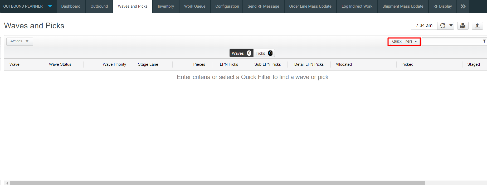
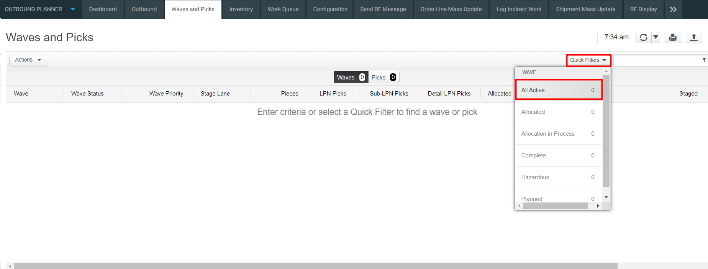
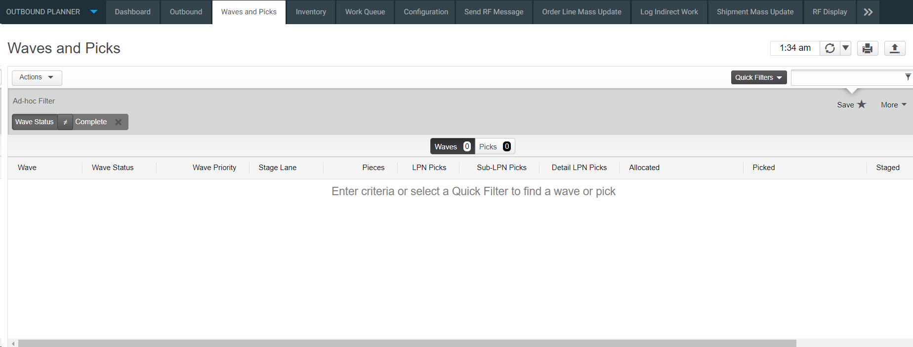
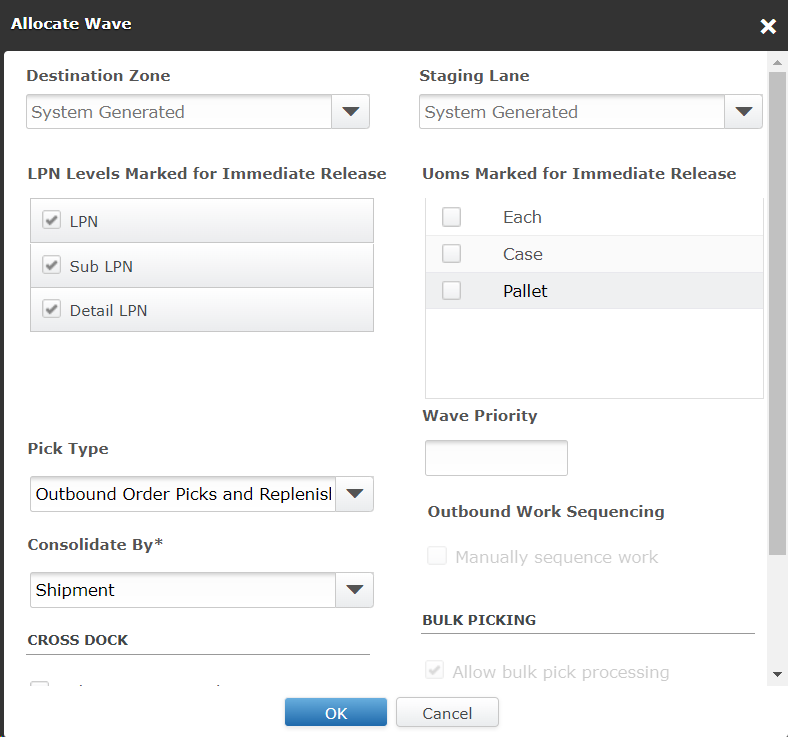

# **BASE_OUB_0030000_WAVE_ALLOC_MOCA_V001**

<!-- SMART_DOC_GEN_TEST_DESCR - Start -->
The BASE tests provide a way to plan multiple orders to a single wave.  It builds upon the same concepts to now allocate that wave.  So the whole framwework thus allows at this time to allocate multiple orders that were created earlier and planned to a single wave.
<!-- SMART_DOC_GEN_TEST_DESCR - End -->

## **Test Category**
**☐** Custom

**☐** Smart IS

**🗹** Standard

## **Overview**
Wave allocation in Blue Yonder is a strategic process that involves
grouping orders together to streamline handling and improve operational
efficiency. By consolidating orders into waves, businesses can better
manage their inventory, optimize warehouse space, and reduce operational
costs. This approach allows for the simultaneous processing of multiple
orders, making tasks such as picking, packing, and shipping more
efficient. Wave allocation also enables businesses to prioritize orders
based on various factors, such as delivery deadlines or order sizes,
ensuring that critical orders are processed quickly and accurately.

Whether done manually or automatically, wave allocation in Blue Yonder
helps businesses plan shipments effectively, minimizing the time and
effort required for order fulfillment. By organizing orders into waves,
businesses can improve the overall workflow in their warehouses, leading
to faster order processing times and improved customer satisfaction.
Additionally, wave allocation can help businesses adapt to changing
demand patterns and seasonal fluctuations, allowing them to adjust their
inventory and production schedules accordingly. Overall, wave allocation
in Blue Yonder is a valuable tool for businesses looking to streamline
their operations and enhance their competitiveness in the market.

## **Applicable versions**

This test is designed to support versions greater than **2008.x.x**,
ensuring compatibility and smooth operation with the latest software
releases. Users can confidently utilize this test, as it is optimized
for newer versions while retaining a user-friendly testing process.

## **Test Arguments**

Test arguments are parameters or inputs that are passed to the test
cases to customize the test execution. These arguments provide
flexibility and allow for the reuse of the same test case with different
sets of data or configurations. The input is as follows:

<!-- SMART_DOC_GEN_TEST_ARG - Start -->
<table>
<tr><th>Arguments</th><th>Argument Description</th></tr>
<tr><td>consby</td><td>If this parameter is not passed, it should default to ship_id.</td></tr>
<tr><td>pcksts</td><td>This parameter is passed on allocated wave. If it is not passed, it should default to "H"</td></tr>
<tr><td>pcktyp</td><td>If this parameter is not passed, it should default to "PICK-N-REPLEN-N-SHIP".</td></tr>
<tr><td>schbat</td><td>This parameter specifies the schbat to create. If it is not passed, the uc_schbat_expr expression is used to determine its value.</td></tr>
<tr><td>uc_move_pcksts_to_p</td><td>After allocation, this parameter is used to mark "H" picks to "P". If it is not passed, it should default to "1".</td></tr>
<tr><td>uc_schbat_expr</td><td>If an explicit schbat is not passed, this expression is used to default it. The expression seems to concatenate the string "ADATAW-" with the value of uc_test_exec_seqnum.</td></tr>
<tr><td>uc_test_exec_seqnum</td><td>During each run, it generates unique base-36 value.</td></tr>
<tr><td>wh_id</td><td>If this parameter is not passed, the system should use the first shipment line in the wave to determine its value.</td></tr>
</table>
<!-- SMART_DOC_GEN_TEST_ARG - End -->

## **TestCases using this test**

This section provides a comprehensive list of test cases that are associated with this particular test. It provides a quick reference for understanding the specific tests covered. By reviewing these test cases, users can gain a deeper understanding of how this test is used in different scenarios and ensure comprehensive test coverage.

<!-- SMART_DOC_GEN_TEST_CASE_USING_THIS - Start -->
| Test Case ID | Test Case Description |
| ------------ | --------------------- |

<!-- SMART_DOC_GEN_TEST_CASE_USING_THIS - End -->

## **RunSets using this test**

This section details the various RunSets that utilize this test as part of their execution. Each RunSet represents a collection of tests and configurations that are executed together to achieve specific testing goals. By examining the RunSets that include this test, users can understand how it fits into larger testing scenarios and how it contributes to overall test coverage and automation.

<!-- SMART_DOC_GEN_RUN_SET_USING_THIS - Start -->
| Run Set ID | Run Set Description |
| ---------- | ------------------- |
| BASE_OUB_000000_CREATE_TO_DISPATCH | create order, plan, allocate, release, pick, dispatch |
| BASE_OUB_001000_TRAFFIC_PLAN_CREATE_TO_DISPATCH | create order, plan, allocate, release, pick, dispatch |

<!-- SMART_DOC_GEN_RUN_SET_USING_THIS - End -->

## **Equivalent Usecase**

The following steps represent a general procedure for Allocating a
planned wave through GUI.

**Step:1**

Select **Configuration** > **Outbound Planner**

**Step:2**

Click on the **\'Wave and Pick\'** screen.

**Step:3**

Use the **Quick Filter** by clicking it.

**Step:4**

Choose **\'All Active Waves\'** from the options.

**Step:5**

Select the **specific wave** you want to **allocate**. Wave will be
shown in wave column.

**Step:6**

Go to the \'**Actions**\' tab and pick **\'Allocate Wave (Planned)**\'.

**Note**: Picks in a specific LPN level are released whenever the check
box for the LPN level is selected for immediate release or when all
three LPN levels are deselected.

**Step:7**

Confirm your choice by clicking \'**OK**\' to allocate the wave.

**Note**: If the application cannot allocate enough inventory to satisfy
the entire wave, the short tag is displayed on the wave as well as on
the associated order, shipment, and load that is short.

## **Applicable MOCA commands**

To allocate a wave using the MOCA command, you can use the following
command.

-   **Allocate wave**

This command will trigger the allocation of a wave based on the
predefined parameters and rules within the MOCA system.

## **Affected DB Tables**

When allocating a wave, the following database tables are typically
affected:

-   **PCKWRK_VIEW**

-   **PCKMOV**

These tables are crucial for tracking inventory movement and allocation
within the warehouse management system.

---

**Previous-Test**
[BASE_OUB_0020000_WAVE_PLAN_MOCA_V001](./tests_docs/BASE_OUB_0020000_WAVE_PLAN_MOCA_V001.md)

**Next-Test**
[BASE_OUB_0040000_WAIT_REL_MOCA_V001](./tests_docs/BASE_OUB_0040000_WAIT_REL_MOCA_V001.md)

[SMART-IS](https://www.smart-is.pk) 
