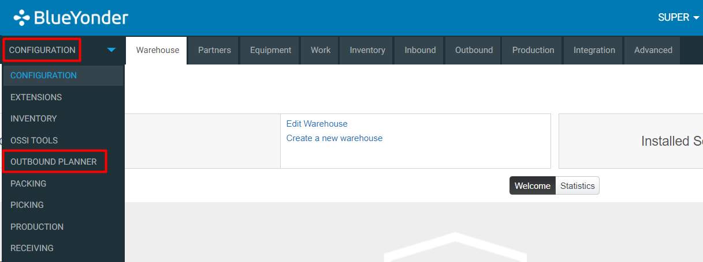

# **BASE_OUB_0040000_WAIT_REL_MOCA_V001**

<!-- SMART_DOC_GEN_TEST_DESCR - Start -->
This test builds upon the concepts of other BASE outbound tests.  It will wait for the allocated wave to become completely released - so the core idea is that it is waiting for the pick release manager to do its job.
<!-- SMART_DOC_GEN_TEST_DESCR - End -->

## **Test Category**

<input type="checkbox" checked disabled> Standard
 
<input type="checkbox" disabled> Custom
 
<input type="checkbox" disabled> Smart IS

## **Overview**
Wave release is a crucial step in the warehouse management process, where batches of orders are released for processing. This release typically follows the wave planning stage and involves assigning orders to specific picking areas or zones within the warehouse. 

During wave release, the system generates pick tasks based on the assigned zones, ensuring that orders are efficiently picked, packed, and shipped. This process helps to optimize warehouse operations by maximizing picking efficiency and minimizing travel time within the warehouse.

By releasing waves of orders in a controlled and systematic manner, businesses can ensure that orders are processed in a timely fashion, leading to improved order fulfillment rates and customer satisfaction.

## **Applicable versions**

This test is designed to support versions greater than **2008.x.x**,
ensuring compatibility and smooth operation with the latest software
releases. Users can confidently utilize this test, as it is optimized
for newer versions while retaining a user-friendly testing process.

## **Test Arguments**

Test arguments are parameters or inputs that are passed to the test
cases to customize the test execution. These arguments provide
flexibility and allow for the reuse of the same test case with different
sets of data or configurations. The input is as follows:

<!-- SMART_DOC_GEN_TEST_ARG - Start -->
<table>
<tr><th>Arguments</th><th>Argument Description</th></tr>
<tr><td>schbat</td><td>What is the schbat we should create. If not passed in we use the uc_schbat_expr to come up with it</td></tr>
<tr><td>uc_max_iter</td><td>To avoid infinite loop, we cap the # iterations. Default is 1000</td></tr>
<tr><td>uc_schbat_expr</td><td>If explicit schbat is not passed. We will default it using "ADATAW" || @uc_test_exec_seqnum</td></tr>
<tr><td>uc_sleep_ms_after_r_before_list_check</td><td>When we are doing list, pckwrk goes to R temporarily and then to L – so to avoid getting wrong R, once it detects all pckwrk in R – wait for this many milli-seconds before looking for lists. Default is 10000</td></tr>
<tr><td>uc_sleep_ms_each_iter</td><td>It provides a pattern for load numbers to move.</td></tr>
<tr><td>uc_test_exec_seqnum</td><td>During each run, it generates unique base-36 value.</td></tr>
<tr><td>Wh_id</td><td>If not passed in, we see first shipment line in the wave and select the wh_id from there.</td></tr>
</table>
<!-- SMART_DOC_GEN_TEST_ARG - End -->

## **TestCases using this test**

This section provides a comprehensive list of test cases that are associated with this particular test. It provides a quick reference for understanding the specific tests covered. By reviewing these test cases, users can gain a deeper understanding of how this test is used in different scenarios and ensure comprehensive test coverage.

<!-- SMART_DOC_GEN_TEST_CASE_USING_THIS - Start -->
| Test Case ID | Test Case Description |
| ------------ | --------------------- |

<!-- SMART_DOC_GEN_TEST_CASE_USING_THIS - End -->

## **RunSets using this test**

This section details the various RunSets that utilize this test as part of their execution. Each RunSet represents a collection of tests and configurations that are executed together to achieve specific testing goals. By examining the RunSets that include this test, users can understand how it fits into larger testing scenarios and how it contributes to overall test coverage and automation.

<!-- SMART_DOC_GEN_RUN_SET_USING_THIS - Start -->
| Run Set ID | Run Set Description |
| ---------- | ------------------- |
| BASE_OUB_000000_CREATE_TO_DISPATCH | create order, plan, allocate, release, pick, dispatch |
| BASE_OUB_001000_TRAFFIC_PLAN_CREATE_TO_DISPATCH | create order, plan, allocate, release, pick, dispatch |
| BASE_OUB_000100_CREATE_TO_DISPATCH_USING_FRONT_END | create order, plan, allocate (web), release, pick, dispatch |

<!-- SMART_DOC_GEN_RUN_SET_USING_THIS - End -->

**Equivalent Usecase**

The following steps represent a general procedure for planned wave
through GUI.

**Step:1**

Select **Configuration** > **Outbound Planner**

**Step:2**

Click on the **'Wave and Pick'** screen.

**Step:3**

From the **Actions **drop-down list, select **Plan Wave.**

**Step:4**

Under **Search Criteria**, from the **Rule Name** drop-down list, select
the rule that defines the parameters by which to search for orders or
shipments. Click **Search**. The orders or shipments that meet the
search criteria are displayed.

**Step:5**

Click **Plan Wave.**

## **Applicable MOCA commands**

To plan a wave using the MOCA command, you can use the following
command.

-  **process wave rules**

This command will trigger the plan wave based on the predefined
parameters and rules within the MOCA system.

## **Affected DB Tables**
When planning a wave, the following database table is typically
affected:

-   **Ord_line**

This table contains information about the planning waves for efficient
picking and processing in a warehouse environment.

---

**Previous-Test**
[BASE_OUB_0030000_WAVE_ALLOC_MOCA_V001](./tests_docs/BASE_OUB_0030000_WAVE_ALLOC_MOCA_V001.md)

**Next-Test**
[BASE_OUB_0050000_LIST_PICK_MOCA_V001](./tests_docs/BASE_OUB_0050000_LIST_PICK_MOCA_V001.md)

[SMART-IS](https://www.smart-is.pk) 

