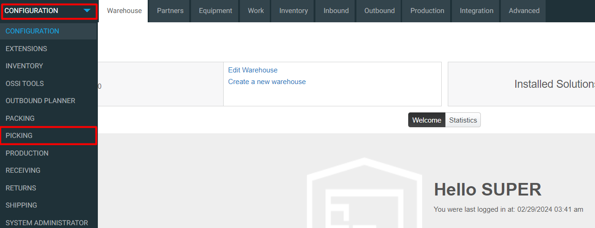
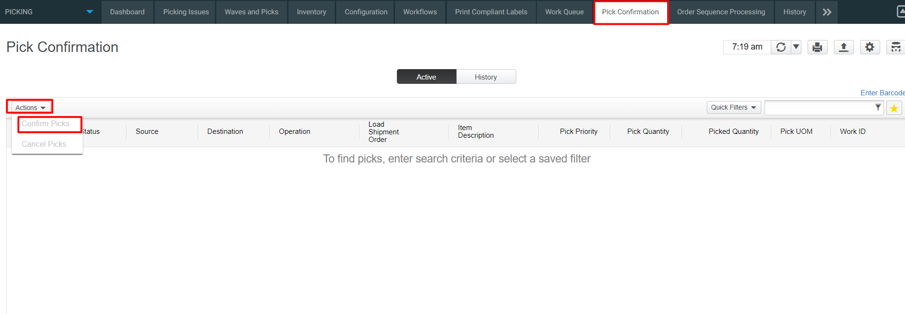

# **BASE_OUB_0050100_LIST_PICK_RF_V001**

<!-- SMART_DOC_GEN_TEST_DESCR - Start -->
This test will perform the differnt types of picks on RF
<!-- SMART_DOC_GEN_TEST_DESCR - End -->

## **Test Category**

**☐** Custom

**☐** Smart IS

**🗹** Standard

## **Overview**

List picking in Blue Yonder warehouse management system typically involves the process of fulfilling customer orders by selecting and collecting items from the warehouse based on a generated picking list. This list is dynamically created, considering factors such as inventory levels, order priorities, and optimal picking routes. The software aims to optimize the efficiency of the picking process by organizing items in a logical sequence, reducing travel time for warehouse personnel.

Additionally, Blue Yonder system often incorporates features like barcode scanning and real-time inventory updates to enhance accuracy and streamline the overall order fulfillment process, contributing to improved customer satisfaction and operational effectiveness.

**Applicable versions**

This test is designed to support versions greater than 2008.x.x, ensuring compatibility and smooth operation with the latest software releases. Users can confidently utilize this test, as it is optimized for newer versions while retaining a user-friendly testing process.

**Test Arguments**

Test arguments are parameters or inputs that are passed to the test
cases to customize the test execution. These arguments provide
flexibility and allow for the reuse of the same test case with different
sets of data or configurations. The input is as follows:

<!-- SMART_DOC_GEN_TEST_ARG - Start -->
<table>
<tr><th>Arguments</th><th>Argument Description</th></tr>
<tr><td>ordnum</td><td>Order number</td></tr>
<tr><td>schbat</td><td>This parameter specifies the schbat to create. If it is not passed, the uc_schbat_expr expression is used to determine its value.</td></tr>
<tr><td>ship_id</td><td>Can pass in an explicit ship_id if needed.</td></tr>
<tr><td>uc_test_exec_seqnum</td><td>During each run, it generates a unique base-36 value.</td></tr>
<tr><td>wh_id</td><td>This refers to the warehouse ID.</td></tr>
</table>
<!-- SMART_DOC_GEN_TEST_ARG - End -->

## **TestCases using this test**

This section provides a comprehensive list of test cases that are associated with this particular test. It provides a quick reference for understanding the specific tests covered. By reviewing these test cases, users can gain a deeper understanding of how this test is used in different scenarios and ensure comprehensive test coverage.

<!-- SMART_DOC_GEN_TEST_CASE_USING_THIS - Start -->
| Test Case ID | Test Case Description |
| ------------ | --------------------- |

<!-- SMART_DOC_GEN_TEST_CASE_USING_THIS - End -->

## **RunSets using this test**

This section details the various RunSets that utilize this test as part of their execution. Each RunSet represents a collection of tests and configurations that are executed together to achieve specific testing goals. By examining the RunSets that include this test, users can understand how it fits into larger testing scenarios and how it contributes to overall test coverage and automation.

<!-- SMART_DOC_GEN_RUN_SET_USING_THIS - Start -->
| Run Set ID | Run Set Description |
| ---------- | ------------------- |

<!-- SMART_DOC_GEN_RUN_SET_USING_THIS - End -->

## **Equivalent Usecase**

The following steps represent a general procedure for list Picking through GUI.

**Step:1**

Select **Configuration** > **Picking**

**Step:2**

Click on the **'pick confirmation'** screen.

**Step:3**

Click on **quick filter** tab.

**Step:4**

Go to the '**Actions**' tab and click on 'Confirm Picks'.

**Step:5**

Pick Confirmation Screen will open and the Press **Confirm Pick**

## **Applicable MOCA commands**

For list pick using the MOCA command, you can use the following command.

-   **List available inventory for pick in location**

This command will perform list picking and this command is based on the predefined parameters and rules within the MOCA system.

## **Affected DB Tables**

When list pick action performs, the following database tables are typically affected:

-   **Pcklst**

-   **Pckwrk_view**

-   **Wrkque**

-   **Ord_line**

These tables are crucial for list picking within the warehouse management system.

---
**Previous-Test**
 [BASE_INV_0020100_MOVE_RF_V001](./tests_docs/BASE_INV_0020100_MOVE_RF_V001.md)
 
**Next-Test**
  [BASE_INB_0001100_COPY_TEMPLATE_RCVTRK_MOCA_V001](./tests_docs/BASE_INB_0001100_COPY_TEMPLATE_RCVTRK_MOCA_V001.md)
  
  [SMART-IS](https://www.smart-is.pk) 