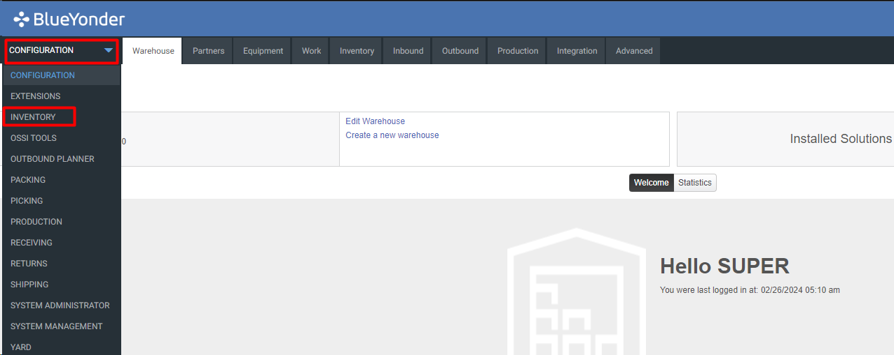
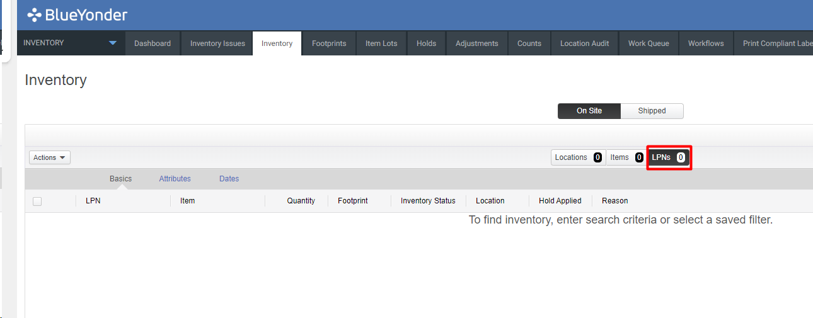
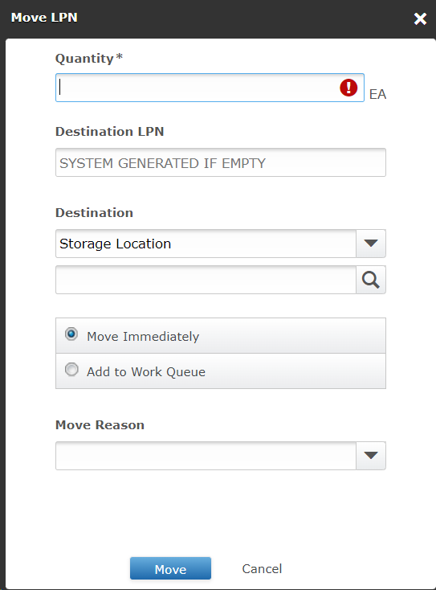

# **BASE_OUB_0060000_PICK_HOP_MOCA_V001**

<!-- SMART_DOC_GEN_TEST_DESCR - Start -->
This test builds on other BASE outbound tests.  Once inventory has been picked, it will move the picked loads through all the open hops using standard MOCA commands.
<!-- SMART_DOC_GEN_TEST_DESCR - End -->

## **Test Category**

**☐** Custom

**☐** Smart IS

**🗹** Standard

## **Overview**

In this concept, picked inventory will be transported through a series
of hops, representing different stages or locations in the warehouse or
distribution center. Each hop signifies a step in the process where the
inventory moves closer to its destination, such as from picking to
packing or from one area of the warehouse to another. This approach
streamlines the movement of inventory by breaking down the process into
smaller, manageable steps, ensuring that inventory is efficiently
transferred and processed at each hop.

To implement this concept, users will need to understand the workflow of
moving inventory through hops, including how to initiate and track the
movement of inventory at each hop. This may involve using a system or
software to manage the movement of inventory, as well as coordinating
with other team members or departments to ensure that inventory is moved
smoothly through each hop. By following this concept, users can optimize
the movement of inventory within their warehouse or distribution center,
improving efficiency and reducing the risk of errors or delays in the
process.

**Applicable versions**

This test is designed to support versions greater than **2008.x.x**,
ensuring compatibility and smooth operation with the latest software
releases. Users can confidently utilize this test, as it is optimized
for newer versions while retaining a user-friendly testing process.

**Test Arguments**

Test arguments are parameters or inputs that are passed to the test
cases to customize the test execution. These arguments provide
flexibility and allow for the reuse of the same test case with different
sets of data or configurations. The input is as follows:

<!-- SMART_DOC_GEN_TEST_ARG - Start -->
<table>
<tr><th>Arguments</th><th>Argument Description</th></tr>
<tr><td>dstlod</td><td>This specifies which load to pick to. By default use "ALD" || @uc_test_exec_seqnum || "AA" || @list_id</td></tr>
<tr><td>Schbat</td><td>Can pass in an explicit schbat if needed</td></tr>
<tr><td>Ship_id</td><td>Can pass in an explicit ship_id if needed</td></tr>
<tr><td>uc_move_hop_cnt</td><td>You can specify how many hops to make. If not specified, all hops are included</td></tr>
<tr><td>uc_move_till_stoloc</td><td>you can specify a location to move to.</td></tr>
<tr><td>uc_schbat_expr</td><td>It helps determine a schbat if one is not provided. Default is "ADATAW-"|| @uc_test_exec_seqnum</td></tr>
<tr><td>uc_srcloc_expr</td><td>This determines which source locations to filter for picked loads. Default is %</td></tr>
<tr><td>uc_srclod_expr</td><td>This determines which source loads to filter for</td></tr>
<tr><td>uc_test_exec_seqnum</td><td>It serves as a unique identifier for inventory items. It helps identify the specific picked inventory we are referring to.</td></tr>
</table>
<!-- SMART_DOC_GEN_TEST_ARG - End -->

## **TestCases using this test**

This section provides a comprehensive list of test cases that are associated with this particular test. It provides a quick reference for understanding the specific tests covered. By reviewing these test cases, users can gain a deeper understanding of how this test is used in different scenarios and ensure comprehensive test coverage.

<!-- SMART_DOC_GEN_TEST_CASE_USING_THIS - Start -->
| Test Case ID | Test Case Description |
| ------------ | --------------------- |
| BASE_ALL_GEN | null |

<!-- SMART_DOC_GEN_TEST_CASE_USING_THIS - End -->

## **RunSets using this test**

This section details the various RunSets that utilize this test as part of their execution. Each RunSet represents a collection of tests and configurations that are executed together to achieve specific testing goals. By examining the RunSets that include this test, users can understand how it fits into larger testing scenarios and how it contributes to overall test coverage and automation.

<!-- SMART_DOC_GEN_RUN_SET_USING_THIS - Start -->
| Run Set ID | Run Set Description |
| ---------- | ------------------- |
| BASE_OUB_000000_CREATE_TO_DISPATCH | create order, plan, allocate, release, pick, dispatch |
| BASE_OUB_001000_TRAFFIC_PLAN_CREATE_TO_DISPATCH | create order, plan, allocate, release, pick, dispatch |

<!-- SMART_DOC_GEN_RUN_SET_USING_THIS - End -->

## **Equivalent Usecase**

The following steps represent a general procedure for moving inventory
from one hop to another hop through GUI.

**Step:1**

Select **Configuration** > **Inventory**

**Step:2**

Click on the **Inventory** screen.

**Step:3**

Click on the **LPN** screen.

**Step:4**

After that all LPNs are shown in it. You just need to select the LPN and
click Action and Move inventory from one hop to another.

**Step:5**

At this point we have to give it the next hop location (Destination
location) , After that you just need to click on move.

## **Applicable MOCA commands**
When picked inventory will be transported through a series of hops using
the MOCA command, you can use the following command.

-   **MOVE INVENTORY**

This command will trigger the picked inventory to be transported through
a series of hops based on the predefined parameters and rules within the
MOCA system.

## **Affected DB Tables**

When picked inventory will be transported through a series of hops,
the following database tables are typically affected:

-   **pckwrk_view**

-   **shipment_line**

-   **invlod**

-   **locmst**

These tables are likely to be updated or referenced as the picked
inventory is transported through the series of hops.

---

 **Previous-Test**
 [BASE_OUB_0050000_LIST_PICK_MOCA_V001](./tests_docs/BASE_OUB_0050000_LIST_PICK_MOCA_V001.md)
 
**Next-Test**
  [BASE_OUB_0301000_TRLR_CLOSE_DISPATCH_MOCA_V001](./tests_docs/BASE_OUB_0301000_TRLR_CLOSE_DISPATCH_MOCA_V001.md)
  
[SMART-IS](https://www.smart-is.pk) 