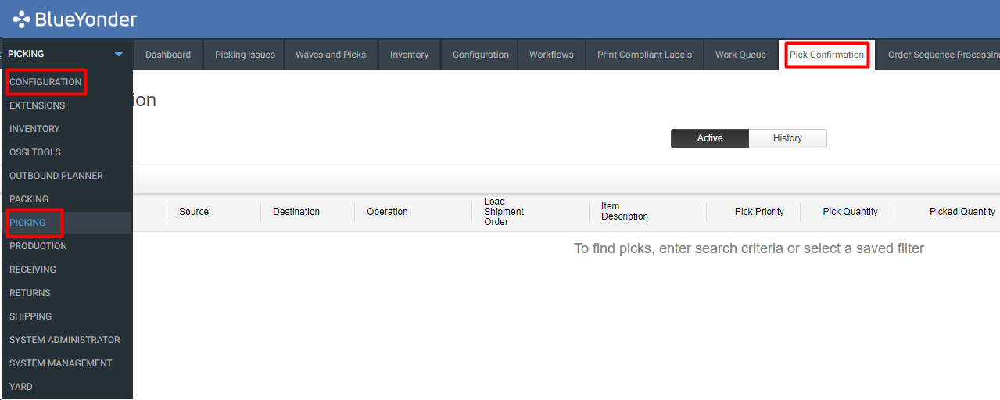

# **BASE_OUB_0070A00_VAS_SMART_PREP_MOCA_V001**

<!-- SMART_DOC_GEN_TEST_DESCR - Start -->
(Smart Extension).  This tests a typical Smart IS flow for VAS.  The picked inventory is brought to a workstation where some services are performed.  These services are termed [prep] services for a later VAS operation.  The test performs those actions and consumes the services.
<!-- SMART_DOC_GEN_TEST_DESCR - End -->

## **Test Category**

**☐** Custom  
**🗹** Smart IS  
**☐** Standard  

## **Overview**

In this concept, we want to pick any orders in the wave via MHE. The implementation is per typical Smart IS implementations.

This implementation builds on the foundation of Smart IS principles, ensuring that the MHE-based order selection process seamlessly integrates with existing warehouse management systems. By following the typical Smart IS approach, the new concept aims to maintain compatibility and consistency with established practices, ensuring a smooth transition to the enhanced order picking process using MHE.

## **Applicable versions**

This test is designed to support versions greater than **2008.x.x**, ensuring compatibility and smooth operation with the latest software releases. Users can confidently utilize this test, as it is optimized for newer versions while retaining a user-friendly testing process.

## **Test Arguments**

Test arguments are parameters or inputs that are passed to the test cases to customize the test execution. These arguments provide flexibility and allow for the reuse of the same test case with different sets of data or configurations. The input is as follows:

<!-- SMART_DOC_GEN_TEST_ARG - Start -->
<table>
<tr><th>Arguments</th><th>Argument Description</th></tr>
<tr><td>lodnum</td><td>Optionally pass in a load number.</td></tr>
<tr><td>schbat</td><td>Optionally pass in a batch number.</td></tr>
<tr><td>uc_inhibit_initiate</td><td>Optionally pass in 1 to inhibit the initiate command.</td></tr>
<tr><td>uc_inhibit_prevalidate_workflow_execution</td><td>If 1 is passed, during workflow execution, validation is bypassed, useful for bypassing pre-line checks.</td></tr>
<tr><td>uc_prep_arecod</td><td>An area code. If passed without a location, the first empty location is used (1CPKPRE).</td></tr>
<tr><td>uc_prep_devcod</td><td>An explicit device code. If not passed in, uc_prep_arecod is used.</td></tr>
<tr><td>uc_schbat_expr</td><td>If schbat is not passed, an expression to determine it (default: 'ADATAW-' || @uc_test_exec_seqnum).</td></tr>
<tr><td>uc_serv_id_list</td><td>A list of sub-lists separated by :. Each sub-list indicates services, service instructions, exit points, and publish data where clause.</td></tr>
<tr><td>uc_test_exec_seqnum</td><td>During each run, uc_test_exec_seqnum generates a unique base-36 value.</td></tr>
<tr><td>uc_vas_cmpl_action_cd</td><td>Code for the complete call (CMPLPAKP).</td></tr>
<tr><td>uc_vas_init_action_cd</td><td>Code for the initiate call (PREPPAKC).</td></tr>
<tr><td>wh_id</td><td>This is the warehouse ID.</td></tr>
</table>
<!-- SMART_DOC_GEN_TEST_ARG - End -->

## **TestCases using this test**

This section provides a comprehensive list of test cases that are associated with this particular test. It provides a quick reference for understanding the specific tests covered. By reviewing these test cases, users can gain a deeper understanding of how this test is used in different scenarios and ensure comprehensive test coverage.

<!-- SMART_DOC_GEN_TEST_CASE_USING_THIS - Start -->
| Test Case ID | Test Case Description |
| ------------ | --------------------- |

<!-- SMART_DOC_GEN_TEST_CASE_USING_THIS - End -->

## **RunSets using this test**

This section details the various RunSets that utilize this test as part of their execution. Each RunSet represents a collection of tests and configurations that are executed together to achieve specific testing goals. By examining the RunSets that include this test, users can understand how it fits into larger testing scenarios and how it contributes to overall test coverage and automation.

<!-- SMART_DOC_GEN_RUN_SET_USING_THIS - Start -->
| Run Set ID | Run Set Description |
| ---------- | ------------------- |

<!-- SMART_DOC_GEN_RUN_SET_USING_THIS - End -->

## **Equivalent Usecase**

The following steps represent a general procedure for pick any orders in the wave via MHE through GUI.

**Step:1**

Select **Configuration** > **Outbound Planner**

**Step:2**

Click on the **'Wave and Pick'** screen.

**Step:3**

We simply allocate the order. MHE smart pick are shown in **picks** after allocation.

**Step:4**

After release pick, Smart VAS Pack Prep are shown in pick confirmation.

## **Applicable MOCA commands**

For Smart VAS Pack Prep, using the MOCA command, you can use the following command.

-   **complete usr vas operation**

This command will trigger the Smart VAS Pack Prep based on the predefined parameters and rules within the MOCA system.

## **Affected DB tables**

When Smart VAS Pack Prep are created, the following database table is typically affected:

-   **locmst**
-   **inventory_view**

These updates ensure that the system maintains accurate records of inventory and locations affected by the Smart VAS Pack Prep creation process, enabling efficient tracking and management of inventory levels and locations.

---

**Previous-Test**
 [BASE_OUB_0050A00_MHE_SMART_PICK_MOCA_V001](./tests_docs/BASE_OUB_0050A00_MHE_SMART_PICK_MOCA_V001.md)
 
**Next-Test**
  [BASE_OUB_0080A00_SMART_PALBLD_MOCA_V001](./tests_docs/BASE_OUB_0080A00_SMART_PALBLD_MOCA_V001.md)

[SMART-IS](https://www.smart-is.pk) 